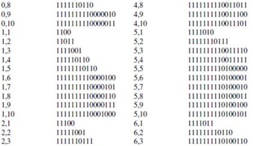
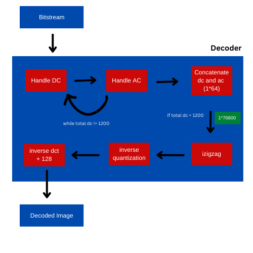

### Notlar 

- DC encoding: DC_code + DC_value 

  + DC_code, dc degerin boyutuna gore belirlenir. Mesela dc deger 6 ise binary formatinda 110 olarak ifade edilir ve dc code'u 100 dir. 
  
  + 100 in yanina 110 eklenir ve dc deger: 100110 seklinde kodlanir.  

  + DC_code tablosu:
     
       

- AC encoding: AC_code + AC_value

  + AC_code, ac degerden onceki 0'a esit olan toplam AC sayisina ve ac degerin binary formatindaki uzunluguna gore hesaplanir.   
 
  + AC code tablosundan bir parca:

       

  + RUN, non-zero sayidan once kac tane 0 oldugunu, CAT ise non-zero ac degerin binary formatinda kac bit ile ifade edilecegini belirtiyor. 
     

 - AC ve DC degerleri bu tablolardaki farkliligi kullanarak ayirt edecegim insallah.
 
 
 - Image decoder algoritma akisi soyledir:

  +  Bitstream den okudugum ilk deger DC deger olacaktir. Bu degerin DC_code tablosunda eslestigi deger bulunur ve ardindan binary degeri okunur. Decimal degere cevrilir. 

  + Daha sonra AC degerler AC_code tablosuna gore AC degerler saptanir ve decimal a cevrilir. Toplam AC degeri 63 oldugunda yeni dc deger alinir ayni zamanda 1 dc 63 ac den olusan 1*64 luk blok olusturulur.  
      
  + 1200 dc deger alindiktan sonraki ac encode lar da cozumlenir. 63 decimal ac deger olusturulduktan sonra son 1*64 luk dc, ac blok olusturulur. Ve netice olarak 1*76800 luk array olusturulmus olunur. 

  + inverse zigzag yapilir. 

  + inverse quantization yapilir. 
      
  + Inverce dct yapilir. 

  + piksel degerlerine 128 eklenir. Bitstream cozumlenmis olunur. 

  + Algoritma flowchart : 

    

