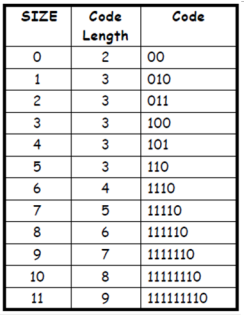

### Notlar 

- DC encoding: DC_code + DC_value 

     + DC_code, dc degerin boyutuna gore belirlenir. Mesela dc deger 6 ise binary formatinda 110 olarak ifade edilir ve dc code'u 100 dir. 

     + 100 in yanina 110 eklenir ve dc deger: 100110 seklinde kodlanir.  

     + DC_code tablosu: 

- AC encoding: AC_code + AC_value

     + AC_code, ac degerden onceki 0'a esit olan toplam AC sayisina ve ac degerin binary formatindaki uzunluguna gore hesaplanir.   

     + AC code tablosundan bir parca: 